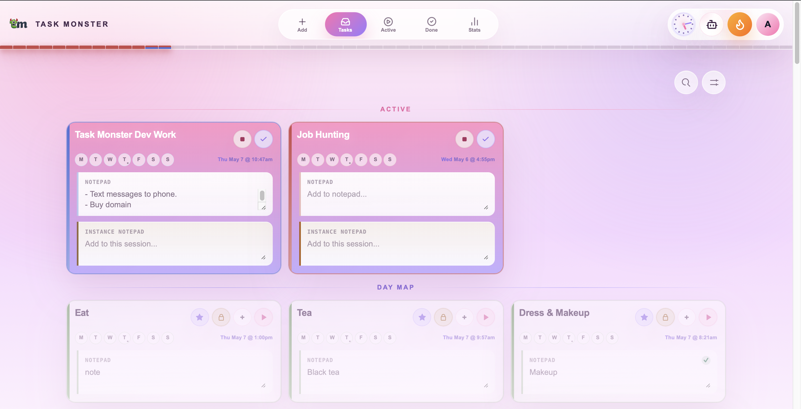
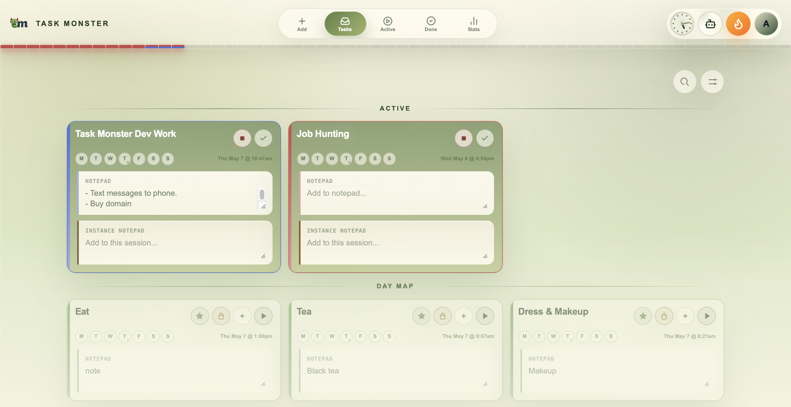
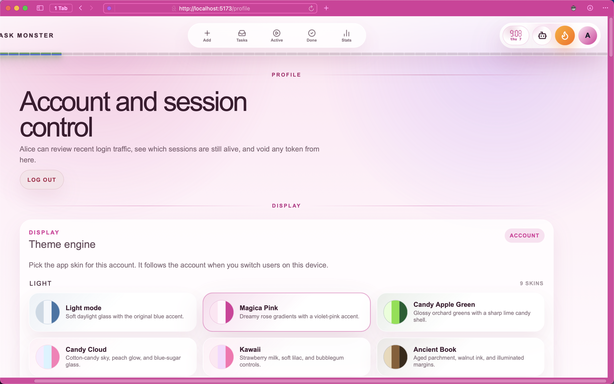

# task-monster

Task Monster is a SvelteKit + Fastify + MongoDB productivity app built around a narrow task flow: choose work for today, run it in Active, finish it into Done, and review the result in Stats. The board is split into `inactive`, `daymap`, `active`, `done`, and `stats` so planning, execution, and history stay separate.

The app also supports timed tasks, tally tasks, multiple local account sessions, account-backed themes, panic tracking, and limited shortcut tokens for five iOS/Apple Watch quick actions.

## Screenshots

The current UI is easiest to recognize by the task board, active sessions, and stats heatmap:

## Current app status

- Public frontend routes:
  - `/`
    - minimalist public homepage using current product screenshots
  - `/auth`
  - `/privacy`
  - `/terms`
- Authenticated frontend routes:
  - `/tasks`
  - `/inactive` redirects to `/tasks`
  - `/daymap` redirects to `/tasks`
  - `/active`
  - `/done`
  - `/stats`
  - `/add`
  - `/profile`
  - `/quick-actions`
- Frontend rendering is client-only
- MongoDB is required for the backend runtime
- Focused frontend state-reconciliation tests run with `npm run test:front`; backend quick-action integration tests run with an explicit disposable MongoDB URL through `npm run test:back`
- Authenticated tabs share a visibility-aware live activity synchronizer: active tasks refresh every 30 seconds while visible, today’s heatmap refreshes at minute boundaries, and focus/reconnect triggers an immediate check
- Account creation is gated by the prerelease alpha code and a required legal-acceptance checkbox
- Production PWA caching is handled by `front/static/sw.js`; dev builds unregister Task Monster service workers and clear local PWA caches
- Theme selection is account-backed through `users.theme`, with a boot-time local cache to avoid a default-theme flash

## Repo layout

- `front/`: SvelteKit frontend
- `back/`: Fastify API and Mongo-backed business logic
- `db/`: scratch area, not a runtime surface
- `AGENTS.md`: canonical handoff for future coding agents

## Environment source of truth

The repo now treats the root `.env` file as the canonical runtime env file for the current frontend and backend.

- tracked template: `.env.example`
- local runtime file: `.env`
- backend loads env from the root `.env`
- frontend Vite env loading points at the repo root, so `PUBLIC_*` vars also come from the root `.env`

If you are setting up a new machine, start by copying `.env.example` to `.env` and then replace placeholders as needed.

## Quick start

1. Use Node `^20.19.0 || >=22.12.0`.
2. Start MongoDB on `127.0.0.1:27017`, or set `MONGO_URL` to another instance.
3. Create a root `.env` from `.env.example`.
4. Install dependencies for both apps from the repo root:
   - `npm install`
5. Start the backend and frontend together:
   - `npm run dev`
6. Open the Vite dev server in your browser.

This repo is an npm workspace (`front` + `back`), so a single root `npm install`
sets up both apps and `npm run dev` runs them concurrently (back on `:3001`,
front on the Vite dev server). To run just one: `npm run dev:back` or
`npm run dev:front`. The per-app commands (`cd front && npm run dev`, etc.) still
work too.

Creating an account currently requires alpha code `gyarados`.
Creating an account also requires agreeing to the current Privacy Policy and Terms & Conditions.

## Backend config

Backend defaults come from the root `.env`, with fallback defaults defined in `back/lib/config.js`:

- `HOST=127.0.0.1`
- `PORT=3001`
- `MONGO_URL=mongodb://127.0.0.1:27017`
- `MONGO_DB_NAME=task-monster`

Frontend API requests use `PUBLIC_API_BASE_URL` from the root `.env`, defaulting to `http://127.0.0.1:3001` if unset. The production GitHub Pages build sets this to `https://taskmonster-api.aurora-bailey.dev`.

Vite dev-server tunnel access uses `PUBLIC_FRONTEND_HOST`. Set it to a hostname without a URL scheme, such as `taskmonster.aurora-bailey.dev`; when present, Vite adds that hostname to its allowed-host list.

## Core runtime model

- Tasks are either `one-time` or `repeatable`
- Tasks track either by `time` or `tally`
- Task color keys are `red`, `orange`, `gold`, `green`, `teal`, `blue`, `violet`, and `pink`; `pink` is the Anima category for soul-healing and divine-feminine activities
- Time-tracked tasks record active runtime and history only
- Repeatable tasks can be `daymapLocked`, which sends them back to the daymap after `done`
- Repeatable tasks can also store `daymapWeekdays`; matching local weekdays are included in Day Map automatically
- The `/tasks` board hot-updates weekday schedule changes and moves cards between Day Map and Inactive without a full board reload
- Active spans are recorded in `task_runs`
- Panic sessions are recorded in `panic_runs`
- Tasks carry nullable timing fields for `nextDueAt`, `lastStartedAt`, `lastCompletedAt`, and `lastInactivatedAt`
- Task cards fade when the task has a `task_runs.startedAt` inside the current local day
- Queueing a scheduled Day Map task materializes it onto the manual daymap before assigning queue order
- When the last active task leaves the table, the backend auto-activates the next queued daymap task if one exists
- Panic does not currently pause tasks automatically; it affects derived effective-time calculations instead

## Main API surface

Public routes:

- `GET /ping`
- `POST /users`
- `POST /sessions/login`

Public frontend routes:

- `/`
  - minimalist public homepage with product positioning, CTA, and real screenshots from `front/static/images/marketing/`
- `/auth`
- `/privacy`
- `/terms`

Auth/session routes:

- `GET /whoami`
- `GET /sessions`
- `DELETE /sessions/:sessionId`
- `POST /sessions/logout`
- `GET /login-attempts`
- `GET /quick-tokens`
- `POST /quick-tokens`
  - returns the raw shortcut token once; only the hash is stored
- `DELETE /quick-tokens/:tokenId`

Quick action routes:

- `POST /api/quick/stop`
  - requires a shortcut token with `tasks:stop`
  - marks all active tasks done for the token owner and starts nothing
  - returns `message: "All active tasks marked done"` for Shortcuts display
  - appends `-- Ended with shortcut` to each completed run's instance note
- `POST /api/quick/next`
  - requires a shortcut token with `tasks:next`
  - marks all active tasks done for the token owner and starts the first queued Day Map task if one exists
  - returns `message: "Next Task: <title>"` or `message: "No next task queued"` for Shortcuts display
  - appends `-- Ended with shortcut` to each completed run's instance note
- `POST /api/quick/start`
  - accepts JSON body `{ "taskId": "<task id>" }`
  - requires a shortcut token with `tasks:start`; legacy `tasks:next` quick tokens are accepted for compatibility
  - marks other active tasks done, starts the requested task, and returns `message: "<title> active"` for Shortcuts display
  - appends `-- Ended with shortcut` to each completed run's instance note
- `POST /api/quick/add-task`
  - accepts JSON body `{ "source": "ios_shortcut", "action": "add-task", "taskId": "<task id>" }`; `source` and `action` are optional
  - requires a shortcut token with `tasks:start`; legacy `tasks:next` quick tokens are accepted for compatibility
  - activates the selected owned task without ending any other active task; queued tasks leave the queue when activated
  - retries are safe and return `message: "<title> active"` without opening a duplicate run
- `POST /api/quick/stop-task`
  - accepts JSON body `{ "source": "ios_shortcut", "action": "stop-task", "taskId": "<task id>" }`; `source` and `action` are optional
  - requires a shortcut token with `tasks:stop`
  - marks only the selected active task Done, appends `-- Ended with shortcut`, leaves other active tasks untouched, and never starts the queue
  - retries return `stoppedCount: 0` with `message: "<title> already stopped"` and create no additional history

Task routes:

- `POST /tasks`
- `GET /tasks/inactive`
- `GET /tasks/daymap`
- `GET /tasks/active`
- `GET /tasks/done`
  - without `day`, supports newest-to-oldest cursor pagination through `limit` and `cursor`
  - with `day`, still returns one local day's done history for compatibility
- `POST /tasks/:taskId/daymap`
- `POST /tasks/:taskId/unmap`
- `POST /tasks/:taskId/queue`
- `POST /tasks/:taskId/unqueue`
- `POST /tasks/:taskId/activate`
- `POST /tasks/:taskId/inactivate`
- `POST /tasks/:taskId/done`
- `POST /tasks/:taskId/archive`
- `POST /tasks/:taskId/tally`
- `PATCH /tasks/:taskId/note`
- `PATCH /tasks/:taskId/instance-note`
- `PATCH /tasks/:taskId/daymap-lock`
- `PATCH /tasks/:taskId`
  - broad task edit route for metadata, notes, next due, tracking type, tally fields, daymap lock, and active started time

Panic and stats routes:

- `GET /panic/status`
- `POST /panic/start`
- `POST /panic/stop`
- `GET /stats/daily`
  - local-day endpoint with summary, overlap, cadence, panic, done, and session details
- `GET /stats/heatmap`
  - current `/stats` page endpoint; returns clipped task-run sessions for 10-day minute-map batches by default

## Useful docs

- `AGENTS.md`: agent-oriented handoff and current repo reality
- `front/README.md`: frontend-specific notes
- `back/README.md`: backend-specific notes
- `db/readme.md`: what the `db/` folder is and is not

## Verification

Current cheap smoke checks:

- `TEST_MONGO_URL=<mongodb url> npm run test:back` (Mongo-backed quick-action concurrency regression)
- `npm run lint` (frontend prettier check)
- `npm run build` (frontend build)
- `cd front && BASE_PATH=/task-monster PUBLIC_API_BASE_URL=https://taskmonster-api.aurora-bailey.dev npm run build`
- boot the backend against a reachable Mongo instance
